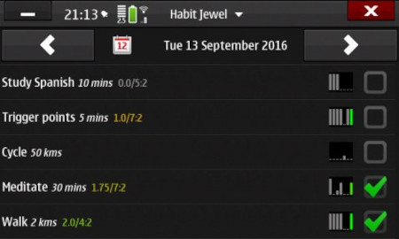
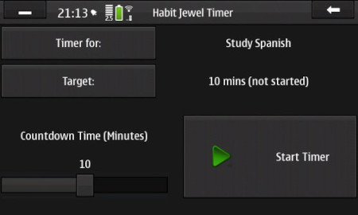
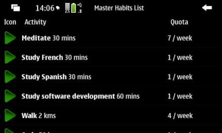
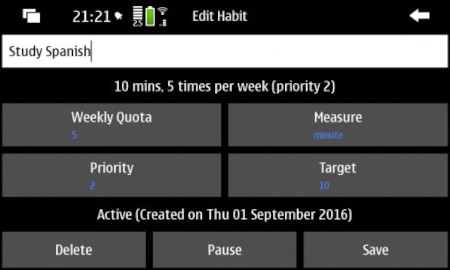

# Habit Jewel for Nokia N900 Maemo OS

## Project no longer active

This project is no longer active as I no longer have a working N900 phone.

## Synopsis

Habit Jewel tracks your habits for each day, motivating you to reach your goals by recording how often you fulfill the habits you have set up for yourself. The idea is that with the knowledge that you are recording the results you will be motivated to make time to do the habits.

## Usage

Basically you define some habits and for each one specify how many times per week you want to do it, i.e. a quota. Until you reach this quota for the current week, the habit will display in Habit Jewel every day. Once you reach it it will drop to the bottom of your habits list (with any other fulfilled or missed habits) until the next week.

Also, habits can be partially completed in increments of 25%.

To set a habit's completion status for a given day, tap and hold on the checkbox icon at the far right of the habit and then select 'Done', 75%, 50%, 25%, 'Missed' (meaning you didn't do it), or 'Clear' ...

The difference between 'Clear' and 'Missed' is that clear resets the habit back to an unknown status - you may have done the habit but not gone back and updated it in Habit Jewel.

On top of this, for habits with a target duration (e.g. 'Practise violin for 20 minutes') there is a built-in countdown timer that will use the selected habit's duration by default. You can also change the countdown time to do more or less. If the timer is started it will count down and then play a sound to notify you.

The daily habits view, which is the main screen, shows some mini bar graphs beside each habit, showing how many times you've completed the habit in the last 7 days. There are also some numbers alongside the habit description: the overall completion total for the habit for the current week / the quota you'd like to reach : the day number of the day currently displayed (Monday = 1, Tuesday = 2, etc).

Tap and holding on the habit description itself allows you to edit the habit, pause it (make it go away - e.g. if you are on holiday), delete the habit (but nothing is really every deleted - see the Master Habits List), etc.

## Possible future enhancements

I plan to build the Stats page that is on the main menu soon, which will show some numbers and graphs.

I also have a plan for each habit to be linked to a specific goal, so you can create the goals and then link the habits that support them. This will mostly be useful for stats purposes, and will be optional.

I've also pondered going in the direction of gamification later, whereby you might get some kind of meaningless but fun virtual 'gifts' or gold coins or other score in the application as you keep doing your habits.

It's somewhat beta at this stage, but should be fairly stable. I have made code changes so that the database schema should be automatically backed up and then upgraded to the version appropriate for the running code without any data loss.

## Screenshots

- 

- 

- 

- 

## Announcement Post

[Post on talk.maemo.org](https://talk.maemo.org/showthread.php?t=97434)